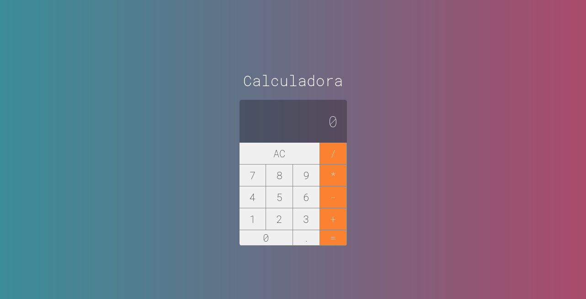

# react-calc

### Motivação

Esse projeto foi criado com o objetivo de aprender mais sobre ReactJS e manipulação da DOM. Sendo assim, foi desenvolvida uma calculadora com as operações matemáticas básicas.

### Pré requisitos

- [NodeJS 14.17+](https://nodejs.org/en/)

### Instalação

- Clonar o repositório: `git clone https://github.com/victormacedo996/react-calc`
- Entrar na pasta do projeto: `cd react-calc` e executar o comando para instalação das dependências: `npm install`

### Execução

- Abrir um terminal e executar o comando: `npm start`

### Tecnologias utilizadas

- HTML5
- CSS3
- ReactJS

### Interface

O design da calculadora seguiu o padrão da calculadora do iOS, tanto na escolha da estilização dos caractéres quanto na disposição e cores do display e dos botões.

